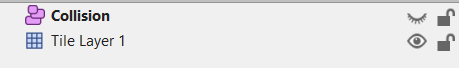

# IndiaEngine Tiled Documentatie
Details  over het gebruik van Tiled zijn [hier](https://doc.mapeditor.org/en/stable/) te vinden.

## Tilesets
De bron van een tileset is een afbeelding. De hoogte en breedte van een tile zijn benodigd om tilesets aan te maken. Als je 1 grote afbeelding wil gebruiken, zoals een deur, dan kan je de grootte van de afbeelding invoeren bij de tile grootte. Zo zeg je tegen Tiled dat de set uit 1 tile bestaat.

## Layers
Layers zijn een groep van dingen zoals tiles of objecten. Ze worden gebruikt om een level te beschrijven.

### Tile layers
**LET OP: Het advies is om tile layers om te zetten naar een PNG bestand in verband met prestaties van de game. Dit wordt behandeld in het [voorbeeld](#Voorbeeld).**

Tile layers worden gebruikt om de layout van een level te maken. Als je tiles met collisie wil hebben, zorg dan dat de custom property "noclip" op de desbetreffende layer op false (uitgevinkt) staat. Tiles worden automatisch geconverteerd naar een Tile object in de game, deze erft over van GameObject.

### Object layers
Object layers zijn speciaal.  Ze bevatten objecten van verschillende types, zoals een vorm, tile of tekst. Collisie wordt automatisch toegevoegd, tenzij de custom property "noclip" is ingeschakeld op object of layer niveau.

## Objecten

### Rechthoek/Rectangle vorm
Dit is een object om collisie aan te geven in een level.

### Tile object
Er kan 1 tegel van een tileset per object gebruikt worden. Dit is handig voor achtergrondplaatjes en de layout van het level.

### Text
Dit object wordt gebruikt om tekst in een level weer te geven.

## Custom properties
|Property|Type|Beschrijving|Van toepassing op
|-|-|-|-|
|noclip|bool|True zorgt voor een collisie component, false voor geen.|Layers en objecten
|args[x]|string|x kan varieren van 0 tot het aantal constructor variabelen min 1. Dit wordt gebruikt voor het doorgeven van custom data van de factory naar het object.|Objecten

## Voorbeeld
**LET OP: Je moet alles in dezelfde folder stoppen en zorgen dat de paden in de JSON bestanden relatief zijn, anders kan de game de resources niet vinden.**

Hier wordt een volledige uitleg gegeven over hoe een level gemaakt kan worden met optimale prestaties.

1. Open Tiled en maak een level (map) aan (CTRL+N)

2. Kies de grootte en sla het bestand op als JSON met de gewenste bestandsnaam
3. Maak een nieuwe tileset aan (rechtsonder in het scherm) en kies de gewenste tile grootte. Dit is vaak 16x16 of 32x32. Sla deze vervolgens op als JSON.

4. Selecteer een of meer tegels uit de tileset en begin te tekenen op het grid. Dit zal er zo uit zien:

5. Voeg een object layer toe (rechtsklik met de muis binnen het layer venster) en noem deze Collision

6. Voeg een rectangle toe en trek deze over de grond heen om de collisie van het level te beschrijven

7. Er is nu een mini wereld, maar elke tegel wordt apart benaderd. Om dit op te lossen kan het volgende gedaan worden:
Maak een PNG van het huidige level. Voor dit level moeten we alle layers op onzichtbaar zetten behalve de tile layer. (Zie de oogjes)

8. Sla het level op als PNG (File -> Export As Image) en neem de volgende instellingen exact over:

9. Voeg deze PNG toe als tileset en gebruik de juiste grootte.

Dit level is dus 1600x1600. Voeg nu een tileset toe met de layout en de gevonden grootte:

Sla ook deze weer op als JSON.

10. Voeg een object layer toe met de naam Layout en voeg een custom property "noclip" toe met het type bool. Vink deze aan.

11. Voeg een object toe en selecteer de volledige layout tile. Zet vervolgens de positie op X 0 en Y gelijk aan de hoogte die er bij staat (in dit geval 3200).

12. Uiteindelijk moet je de layers als volgt togglen (zie de oogjes):

13. Het level is nu klaar voor gebruik!

Download [hier](downloads/example_level.zip) het voorbeeld level om de meeste functionaliteiten in actie te zien.

Verdere implementatie van Tiled in de IndiaEngine is te vinden in het interface document.